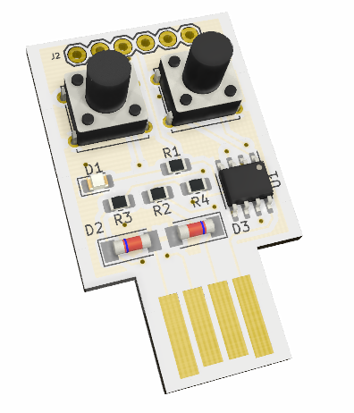
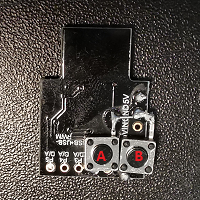
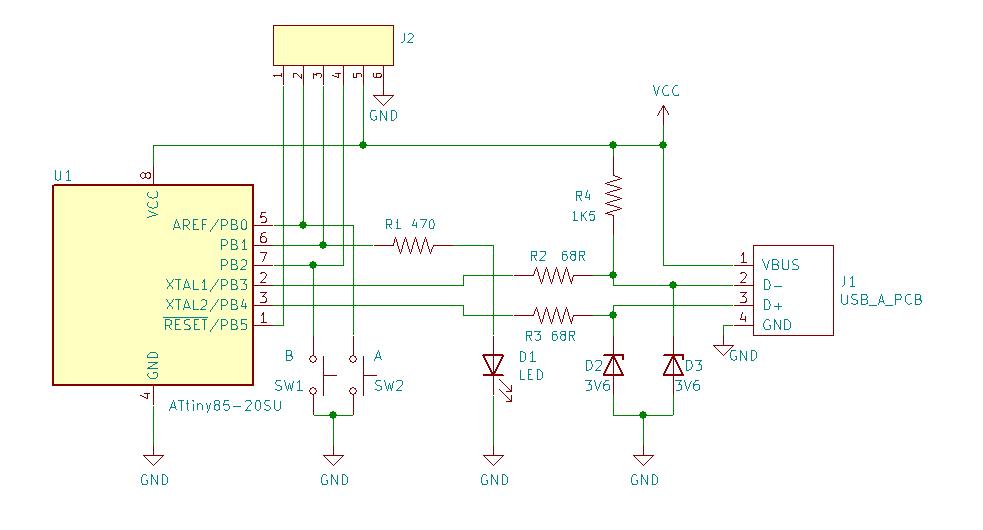
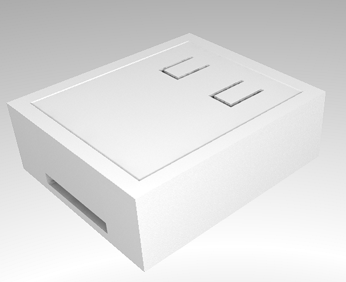

# PwdToken

## Introduction

This started as a hardware implementation of a piece of paper with your password on it and, in some respect, it sill is. So use it with judgment! I toyed at first with the idea mostly of having something to type the WiFi password on new devices or for guests.

Once the novelty of the first quick implementation wore out, I started to wonder how I could make this at least reasonably secure. In its current incarnation the PwdToken offers the following features:

* Runs on a Digispark Digistump (or similart ATTiny85 device)
* Requires only 2 buttons to be soldered to the board
* Stores up to 4 passwords
* Emulates a USB keyboard and types the password
* Easy 2 buttons operation

Security features:
* Unlock password by morse keypad (optional)
* Unlock PIN by binary keypad (optional)
* Mechanism to validate count of boots and passwords recoveries (tamper/usage detection)



# Table of contents

[**Safety**](#safety)

&nbsp;&nbsp;&nbsp;&nbsp;[What makes this reasonably safe](#what-makes-this-reasonably-safe)<br>
&nbsp;&nbsp;&nbsp;&nbsp;[Known vulnerabilities](#known-vulnerabilities)<br>
&nbsp;&nbsp;&nbsp;&nbsp;[What can I do to make it safer?](#what-can-i-do-to-make-it-safer)<br>

[**Build one**](#build-one)

&nbsp;&nbsp;&nbsp;&nbsp;[The hardware](#the-hardware)<br>
&nbsp;&nbsp;&nbsp;&nbsp;[Special bootloader](#special-bootloader-optional)<br>

[**Usage**](#usage)

&nbsp;&nbsp;&nbsp;&nbsp;[Store passwords](#store-passwords)<br>
&nbsp;&nbsp;&nbsp;&nbsp;[Retrieve a password](#retrieve-a-password)<br>
&nbsp;&nbsp;&nbsp;&nbsp;[Getting the token banner](#getting-the-token-banner)<br>

## Safety

Is it safe?

TLDR: **NO**

Long story. It can be reasonably safe depending on your use case. If you often need to log in on computers that are not yours and on which you can't run a password manager, this could be a viable option, especially if the alternative is to use a weak password that you can remember. At least you have shifted the extent of the potential attackers from anyone on the the Internet to anyone who can gain access to your token. 

### What makes this reasonably safe?

The passwords are stored in the actual application, and not in the data EEPROM. This means that if anyone attempts to replace the application with one that just exfiltrates the passwords then the passwords will actually be wiped.

There's a meachanism (optional) to keep track of the boots count and amount of times passwords have been retrieved. A command line application can be used to validate these against a manifest containing, among other information, a shared secret. While this doesn't prevent password theft it makes tampering evident.

### Known vulnerabilities

**do I need to say it? this is bound to be an incomplete list**

* An attacker could craft an .hex file that doesn't override the portion of code with the passwords and exfiltrates them. For this attack to be successfull it would be enough to compromise a host machine and have a microncleus uploader waiting for a device all the time (also the uploader would need to be made not to erase all memory before programming but just to send a page full of 0xFF on the part to override). This is an issue only if the stock micronucleus bootloader is used. This project provides a re-configured version of the bootloader that doesn't start unless button B (P0) is held. Additionally the special bootloader always erases user program on entry which prevents this attack also if the attacker has physical access to the token (assuming he cannot re-program it with an AVR programmer, ie that the board is encased in epoxy and only USB pins are accessible).

* An attacker could connect an AVR programmer and dump the application or replace the bootloader with one that exfiltrates the passwords. This is possible only if the attacker has physical access to the token. This can be mitigated by enclosing the devive in epoxy so that only the USB pins are accessible. While the attacker could still possibly re-program it, this would require access to the device for a longer time and the tampering would be evident.

* Because of the way the password lock works (just waits until the right PIN/Password is entered), and because the onboard LED signals the fact the token is locked, an attacker could build a device that brute forces the PIN/Password quite easily. One possible mitigating action would be to add a max errors after which the device wipes itself. Also in this case physical access to the device is needed to carry out this attack so epoxying the board would suffice.

### What can I do to make it safer?

* Make use of the provided modified bootloader so the device cannot be re-programmed without physical access to it and, even if bootloader is entered, the program is wiped already
* Don't store the full password, use a Horcrux (in a nutshell, make your password something like `fsnf23m!abcSomethingIOnlyKnow` and only store the `fsnf23m!abc` part to then type the reminder)
* Don't leave the token unattended and keep track of your tokens so you can immediately reset the passwords if one is missing
* Encase the device in epoxy so only the USB pins are accessible. This prevents PIN brute force automation as well as bootloaded replacement.

## Build one


### The hardware

If you want to just give this a spin a quick way to start is with a Digispark Digistump or another ATTiny85 board with USB. You will need to add two push buttons. Connect them between P0 and P2 and ground. See photo for one of my prototypes.



If you feel instead like wire wrapping and you have a DIP ATTiny85 you can follow this schematic. J2 is needed only if you need to burn a bootloader, if your ATTiny is already loaded with a bootloader you can omit it.



Alternatively, if you really want to go serious you can find all the Kicad files for the board in the `Board` folder.

### Special bootloader (optional)

You can replace the standard "micronucleus" bootloader that comes with the Digistump and other ATTiny borards, with a version that doesn't wait in the bootloader by default when started. This makes your PwdToken immediately available when plugging it. Once you uploaded the re-configured bootloader you will need to pull P0 low (press button B before inserting the board in the USB port). To carry out this step you will need an ISP. I tested this with a USBASP. Others shouldn't be that much different but you will need to tweak the actual programming command. 

If you choose to skip this step the downside will be that once you plug your board in the USB port you will need to wait about 6 seconds for the bootloader to give up and your program to start.

Another tweak to the bootloader that can make the device safer, is to enable deletion of the user program as soon as it's  the bootloader is entered. In this way it won't be possible in any way to attempt to exfiltrate the passwords through USB. 

**NOTE**: it will be still possible to get to them if the attacker has access to all pins (device not epoxied) as he will be able to replace the bootloader.

See the readme in the "mirconucleus" folder below for instructions on building and flashing the special bootloader.

## Usage

### Store passwords 

**Without manifest**

If you wish to just set up passwords and don't want to generate a manifest to verify the integrity of the token (and to have proof the token has not been used) follow these simple steps:

* Copy `secrets_example.h` to `secrets.h` (this last is .gitignore:d so you don't risk to push your passwords!)
* Edit `secrets.h` and set your passwords and unlock password/pin if desired
* Edit `options.h` and set options as needed 
* Build and upload


**With manifest**

If you choose to generate a manifest for the token you will be able at a later time to verify that the token has not been tampered with and you will be able to determine if and how many times it has been booted and passwords have been retrieved.

To generate a manifest use the command line utility under `CommandLineTool\bin`:

* Run `pwdtoken gen`
* Choose a label for the token
* Choose a secret
* The utility will generate a manifest and store in clipboard
* Store the manifest somewhere safe (eg a password manager)
* The utility will also generate a `secrets.h` file
* Edit `secrets.h` and set your passwords and unlock password/pin if desired (don't change the OTP secret or the label though or you will invalidate the manifest!)
* Edit `options.h` and set options as needed 
* Build and upload


## Retrieve a Password

**note** the token emulates a standard US layout keyboard. You will need to make sure your keyboard layout matches, especially if your password contains symbols that might be mapped to different keys.

* Insert the token in a USB port and wait until the onboard red LED is solid red (or flashing slowly if you choose not to have an unlock PIN/Password)
* Type your PIN/Password if needed
* Once unlocked the onboard red LED will start to flash. The flashes count indicates the selected password
* Press repeatedly button B until the desired password is selected
* Focus on the application/field in which you need to type the password
* Press and hold A for more than 2 seconds and the password will by typed

## Getting the token banner

The token banner is a piece of formatted text that contains non-confidential information and can be used to validate the boot counts as well as to make sure your keyboard layout is correct. The banner is always accessible without unlocking the token. To print the banner follow these steps:

* Open a text editor and ensure it's in focus
* Insert the token while keeping button A pressed (make sure you don't confuse A with B if you have the special bootloader or your passwords will be lost!)
* Release the button as soon as the banner is starting to appear

A banner looks like this:

````
----------- begin -----------

; PwdToken 0.01-B
; Built Apr 14 2021 07:27:29
; Keyboard Layout US
; Hash Backslash: £ #
LBL: TST002
CBO: 3
CRE: 0
OTP: 3158792869

------------ end ------------
````


You can use the `; Hash Backslash: # \` line to validate that the current keyboard layout is correct. Most of the rest of the information in the banner is data needed by the command line utility to validate the boot and password retrieval counters.


## Encase it

In the `case` folder you will find a FreeCad project for a simple case for the token. This is suitable to be filled with epoxy to prevent (easy) access to the passwords through the ISP interface. There's no provision for screws or other fixing mechanisms, the two halves of the shell are meant to be glued together once the epoxy is set.

Top             |  Bottom    | Assembled
:-------------------------:|:-------------------------:|:-------------------------:
  |   |  


